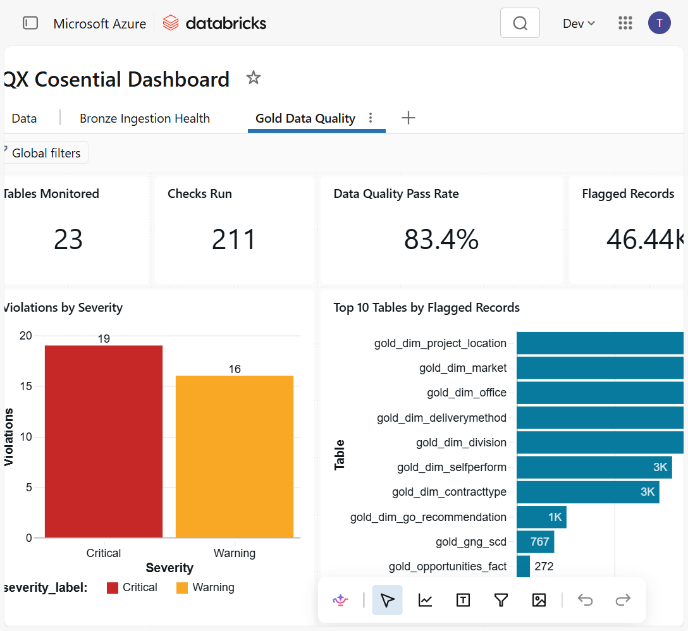
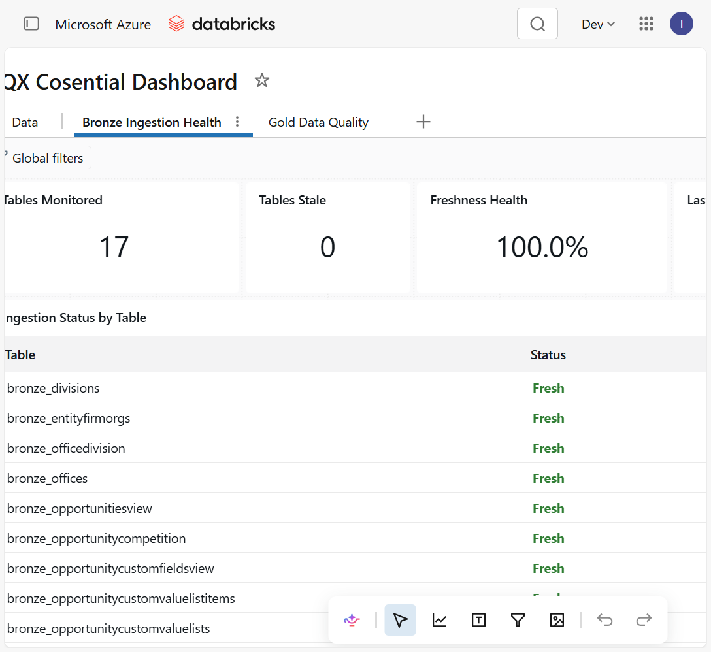
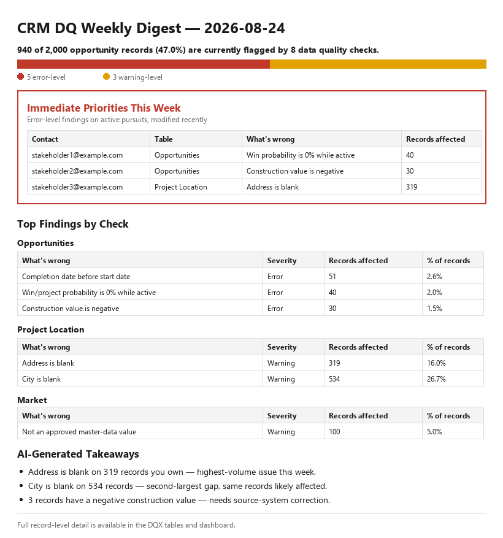
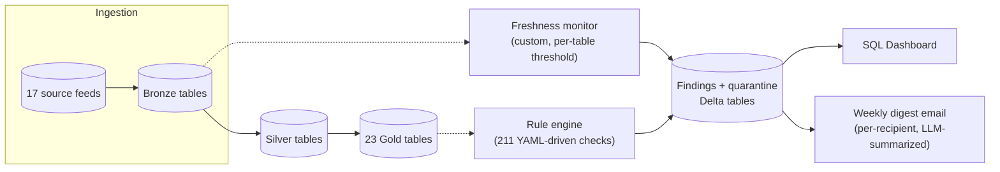

# Automated Data Quality Monitoring Framework (Databricks DQX)

**A production data quality system that found real, previously-invisible problems in a live business pipeline — not a tutorial project.**

During a Data Science internship at a construction industry firm, I designed and shipped an automated data quality system for a business-critical CRM pipeline that had no systematic way to catch bad or missing data. Within weeks it surfaced that the large majority of active records carried an undetected issue, and uncovered a silent completeness bug that had been causing business dashboards to underreport — problems nobody knew existed until this system went live.

*(The code in [`notebooks/`](notebooks/) is the real implementation I wrote, with identifying details masked or genericized — see [Masking notes](#masking-notes).)*

| 211 | 23 | 17 | 84% | ~39% |
|:---:|:---:|:---:|:---:|:---:|
| automated checks | production tables covered | source feeds monitored | of active records flagged with an issue | of records silently missing from a key report — found and root-caused |

**Contents:** [Business impact](#business-impact) · [Before / after](#before--after) · [Dashboard & digest](#live-dashboard-and-weekly-digest) · [Problem](#problem) · [How it works](#how-it-works) · [Masking notes](#masking-notes) · [Skills demonstrated](#skills-demonstrated)

## Business impact

- Stood up **211 automated data quality checks** across **23 production gold tables**, replacing ad hoc, manual spot-checking with continuous, scheduled monitoring across 17 upstream source feeds.
- Early monitoring runs surfaced that **roughly 84% of active pipeline records** carried at least one data quality issue — most commonly missing address/location fields, blank approval fields, and non-standardized category values entered at the source system — issues that had been invisible until this system existed.
- While validating the monitoring output, **discovered and root-caused a data completeness bug**: a key reporting table was silently missing roughly **39% of real, valid records** due to an upstream fact-table build issue — a problem that had gone undetected and was causing business dashboards to underreport.
- Findings are queryable immediately after each run, and pushed proactively to the people who own the affected records via an automated weekly digest, rather than sitting in a table nobody queries.
- Presented findings and the monitoring approach directly to business stakeholders, translating a technical rule-engine implementation into a plain-language "here's what's wrong and why it matters" narrative.
- Designed the framework to generalize beyond its first pipeline — the same pattern was adopted as the starting point for a second source-system integration.

### Before / after

| | Before | After |
|---|---|---|
| **Detection** | Issues found manually, after the fact, whenever someone happened to notice | 211 checks run automatically on every scheduled pipeline run |
| **Visibility** | No record-level view of data quality; problems were anecdotal | Every check result queryable immediately, with a persistent findings + quarantine trail |
| **Ownership** | No routing — a bad record was nobody's problem until it broke a report | Weekly digest emails each stakeholder their own flagged records, in plain language |
| **Completeness** | A ~39% gap in a key reporting table went undetected | Gap found, root-caused, and reported within a single validation pass |
| **Reach** | One pipeline, no shared pattern | Framework generalized and reused as the starting point for a second source-system integration |

### Live dashboard and weekly digest

The Databricks SQL dashboard below is a real snapshot of this system running in production — same numbers as [Business impact](#business-impact) above, from the two monitoring layers described in [How it works](#how-it-works).

**Gold Data Quality** — 23 tables monitored, 211 checks run, **83.4% pass rate**, **46,440 individual records flagged** for review across the dataset, 19 critical / 16 warning checks currently in violation:

**Bronze Ingestion Health** — all 17 source feeds monitored, 100% freshness health at the time of this snapshot:

The weekly digest email below is a **recreation** (real structure and code, placeholder data) — the real emails route to real colleagues by name, which isn't something I can publish. It's generated from the same [`build_header`](notebooks/dqx_crm_digest.py) / severity-bar / findings-table logic as the real digest, personalizes by recipient, and includes an LLM-generated "what to do" summary grounded strictly in that recipient's own flagged records:

## Problem

A production CRM pipeline wrote data through a bronze → silver → gold medallion architecture, but had no systematic way to catch ingestion delays, bad values, or referential-integrity breaks before they reached business dashboards and reports. Issues were being found manually, after the fact, by whoever happened to notice something looked wrong.

## How it works

The engineering behind the impact above:

Designed and implemented an **at-rest data quality monitoring system** using the open-source [`databricks-labs-dqx`](https://github.com/databrickslabs/dqx) framework, running downstream of the existing ingestion jobs so it observes without ever blocking a write.

**Two-layer design:**
- **Bronze — ingestion freshness monitor** ([`dqx_crm_bronze.py`](notebooks/dqx_crm_bronze.py)). A lightweight custom check comparing each table's latest ingestion timestamp against a per-table threshold, tuned differently for full-overwrite vs. incremental-merge load patterns, watching **17 source feeds**.
- **Gold — rule-based validation engine** ([`dqx_crm_gold.py`](notebooks/dqx_crm_gold.py) + [`dqx_crm_gold_checks.yml`](notebooks/dqx_crm_gold_checks.yml)). A YAML-driven rule catalog (**211 checks across 23 production tables**) covering null checks, range/type validation, uniqueness, referential integrity, controlled-vocabulary membership, and cross-table consistency — applied via DQX's metadata-driven check engine.
- **AI-assisted rule authoring** ([`dqx_candidate_rule_generation.py`](notebooks/dqx_candidate_rule_generation.py)). Profiles each table's column statistics and generates draft rule candidates via an LLM call, for a subject-matter expert to review before promotion into the YAML catalog.
- **Weekly digest** ([`dqx_crm_digest.py`](notebooks/dqx_crm_digest.py)). Reads the findings tables and builds a personalized, plain-language email per stakeholder — an LLM call grounded strictly in that recipient's own flagged records, so a business user sees "your records need attention" instead of a table of failed rule names.

Full technical write-up, including the findings/quarantine table schema, environment isolation pattern, and the three cross-table check patterns used: [`docs/ARCHITECTURE.md`](docs/ARCHITECTURE.md). Dashboard SQL queries: [`docs/dashboard-reference.md`](docs/dashboard-reference.md). The stakeholder presentation I gave on this project: [`docs/DQX-Business-Overview.pptx`](docs/DQX-Business-Overview.pptx).

**Engineering details I'm proud of:**
- Designed a shared findings/quarantine table schema that writes one row per check per table per run (including clean passes), so absence of a failure is as visible as a failure — not just "silent success."
- Built environment-aware catalog referencing (dev/prod isolation) via a token-substitution pattern in the YAML rule definitions, so the same rule catalog runs unmodified in both environments.
- Optimized the check-execution engine to run as a **single aggregation pass per table** and build quarantine records as a fully distributed Spark operation — no `.collect()` to the driver — so it scales safely on serverless compute where caching/persisting isn't available.
- CI ([`.github/workflows/ci.yml`](.github/workflows/ci.yml)) lints every notebook and runs [`tools/validate_checks.py`](tools/validate_checks.py) — a standalone schema validator that catches a malformed rule (missing key, invalid criticality, no condition) on every push, before it would fail at runtime in the real `DQEngine.validate_checks()` call.

## Masking notes

This is the real implementation, not a rebuilt demo — so before publishing, I removed or genericized everything that isn't mine to share:

| Removed | Replaced with |
|---|---|
| Real vendor/employer name (appeared throughout) | Generic "CRM" / "CRM pipeline" |
| Real colleague names & email addresses (digest recipients) | Placeholder emails (`stakeholder1@example.com`, ...) |
| Internal Databricks workspace URL & tenant ID | Placeholder URL |
| Internal secret scope name | Generic placeholder name |
| Jira ticket/epic numbers | Removed from comments |
| A hardcoded organization ID used in one validation rule | Placeholder value with an explanatory comment |
| Links to the employer's private GitHub repo | Links to this repo's own files |
| Exact record counts from a real completeness bug (e.g. "X of Y opportunities") | Relative/percentage framing only |
| Real weekly digest emails (real colleague names/emails, real record detail) | Not published — recreated with the real HTML-building logic and placeholder data instead |
| Two screenshots in the stakeholder presentation (`docs/DQX-Business-Overview.pptx`) showed a real client name, a real opportunity ID, and 8 real colleague emails | Both images replaced with genericized recreations in the same visual style; the other 16 slides and all other images are byte-identical to the original |

Catalog, schema, and column names (e.g. `crm_data.opportunities`, `gold_opportunities_fact`) are genericized labels, not the real schema names. The rule *logic*, architecture, and engineering decisions are unmodified — that's the part that's actually mine to show.

**One deliberate exception:** the dashboard screenshots above, and the stock/UI photography inside `docs/DQX-Business-Overview.pptx`, are real and unedited — they still show the real vendor and employer names. Everything else in this repo (code, docs, digest) has those names replaced; these images are kept as-is for authenticity, since cropping or blurring them would undercut the point of showing a real, live system. The two pptx slides that showed a real client relationship and real colleague emails were the one thing replaced, for the reasons above.

## Skills demonstrated

`Databricks` · `PySpark` · `Python` · `SQL` · `YAML-driven rule engines` · `Unity Catalog` · `Databricks SQL Dashboards` · `Data quality engineering` · `Data pipeline architecture (medallion / bronze-silver-gold)` · `LLM-assisted rule generation (human-in-the-loop)` · `Column-level statistical profiling` · `Stakeholder communication`
